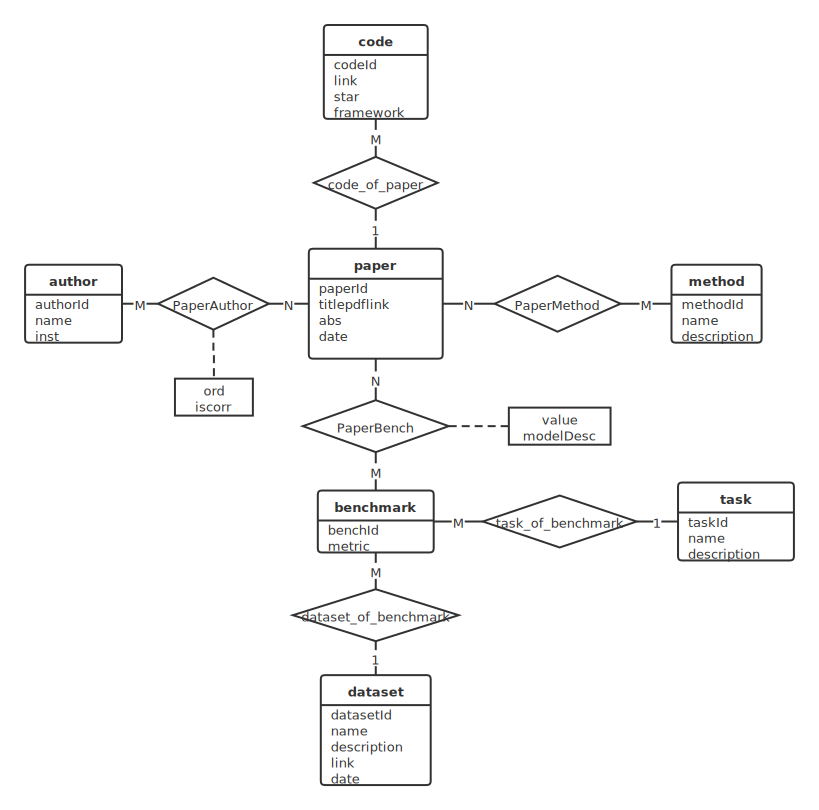

# 数据库系统实践——yet another Papers with Code

## 一、系统需求分析

### 1.系统描述

机器学习是一种将分析模型构建自动化的数据分析方法。它是人工智能的一个分支，其依据是系统可以从数据中学习、识别模式并以最少的人工干预做出决策。机器学习正在越来越多的领域中得到应用，第四次工业革命正在暗潮涌动。

为了更好的推动不同机器学习算法之间的交流、比较、融合、创新，需要一个公共的、开放的数据平台，为所有研究人员提供最新、最好的论文和算法。

yet another Papers with Code 是一个免费开放资源库，收录了大量机器学习论文、代码和及其评估。该系统的核心功能是汇总和整理重要的论文及其对应的代码实现。机器学习论文数量庞大，因此学术界对此已经有了相关评价指标（benchmark），用以衡量论文和算法的优劣程度。评价指标包含其所采用的数据集和所做的机器学习任务（如聚类、深度估计等）。

用户可以从多角度筛选数据。系统中的数据全部由管理员维护，用户只能筛选和查看，不能修改系统中的数据，以保证数据的质量和权威性。

### 2.数据存储需求

本系统中的实体包含：论文、作者、代码、方法、评价指标、数据集、任务。

论文信息包含：论文链接、摘要链接、发表时间。

代码信息包含：代码链接、收藏数、所用框架。

评价指标信息包含：评测指标、特殊条件。

数据集信息包含：描述、链接、发布时间。

作者信息包含：姓名、机构

方法和任务包含一段描述。

每一篇论文都附有一份或多份代码实现，而一份代码唯一属于某一篇论文。一篇论文可能涉及多种机器学习方法，可能包含多名作者。

一篇论文可以参与一个或多个评价指标，获得评分并与其他参与该评测的论文共同排名。一个评价指标有唯一的数据集和任务，而任务和数据集可以对应多个评价指标。

### 3.应用程序功能

前台主要功能如下（按页面标题罗列）：

- 首页
  - 根据名称模糊查找论文
  - 根据时间、代码收藏数对论文进行排序
- 看SOTA：根据任务对应的论文数量对任务排序
- 数据集：
  - 根据名称模糊查找数据集
  - 查询应用到某个任务的数据集
  - 对上述查询结果按相关论文数或者发布时间排序
- 论文页：查看论文详细信息
- 方法页：
  - 根据方法对应的论文数量对方法排序
  - 筛选某一方法的所有论文。在该筛选结果中按论文名模糊查找
- 任务页：
  - 根据任务查询所有相关的评价指标，以及参与该评价指标中得分最高的论文
  - 根据任务查询所有相关的数据集
- 评价指标页：列出某一评价指标的所有相关论文，根据数值列出排行榜
- 数据集页：
  - 查询某个数据集相关的所有评价指标
  - 筛选某一数据集的所有论文。在该筛选结果中按论文名模糊查找
- 作者页：查找某一作者的所有论文

后台主要功能如下：

- 添加论文：在数据库中新增一篇论文及其所有相关信息。包括参与的评价指标等。
- 删除论文：删除某一篇论文及其所有相关信息。包括参与的评价指标等。


## 二、数据库概念设计

### 1.确定实体和属性

分析系统需求，将系统中设计的人、物进行抽象，得到了系统的实体如下：

1. 论文：论文编号、论文标题、论文链接、摘要链接、发表日期
2. 作者：作者编号、姓名、机构
3. 代码：代码编号、代码链接、收藏数、框架
4. 方法：方法编号、方法名、方法描述
5. 评价指标：指标编号、指标内容、特殊条件
6. 机器学习任务：任务编号、任务描述
7. 数据集：数据集编号、数据集描述、数据集链接、创建日期

### 2.E-R图



## 三、数据库逻辑结构设计

### 1.关系模式设计

根据概念结构设计得到的E-R图和转换规则，得到如下关系模式：

1. 论文（论文编号，论文标题，论文链接，摘要链接，发表日期）
2. 作者（作者编号，姓名，机构）
3. 代码（代码编号，论文编号，代码链接，收藏数，框架）。外键：论文编号
4. 方法（方法编号，方法名，方法描述）
5. 评价指标（指标编号，指标内容，特殊条件，数据集编号，任务编号）。外键：数据集编号，任务编号
6. 任务（任务编号，任务描述）
7. 数据集（数据集编号，数据集描述，数据集链接，创建日期）
8. 论文作者（论文编号，作者编号，作者顺序，是否通讯作者）。外键：论文编号，作者编号
9. 论文方法（论文编号，方法编号）。外键：论文编号，方法编号
10. 论文评价（论文编号，指标编号，得分）。外键：论文编号，指标编号

### 2.基本表设计

|   属性名    |   数据类型   | 是否可空 |  键  |   解释   |
| :---------: | :----------: | :------: | :--: | :------: |
|   paperId   |     int      |    否    | 主键 | 论文编号 |
|    title    | varchar(255) |    否    |      | 论文标题 |
|  paperLink  | varchar(255) |    否    |      | 论文链接 |
|  abstLink   | varchar(255) |    否    |      | 摘要链接 |
| publishDate |     date     |    否    |      | 发表日期 |


|   属性名   |   数据类型   | 是否可空 |  键  |   解释   |
| :--------: | :----------: | :------: | :--: | :------: |
|  authorId  |     int      |    否    | 主键 | 作者编号 |
| authorName | varchar(255) |    否    |      |   姓名   |
|    inst    | varchar(255) |    是    |      |   机构   |


|  属性名   |   数据类型   | 是否可空 |  键  |   解释   |
| :-------: | :----------: | :------: | :--: | :------: |
|  codeId   |     int      |    否    | 主键 | 代码编号 |
|  paperId  |     int      |    否    | 外键 | 论文编号 |
| codeLink  | varchar(255) |    否    |      | 代码链接 |
|   stars   |     int      |    否    |      |  收藏数  |
| framework | varchar(255) |    否    |      |   框架   |


|   属性名   |   数据类型   | 是否可空 |  键  |   解释   |
| :--------: | :----------: | :------: | :--: | :------: |
|  methodId  |     int      |    否    | 主键 | 方法编号 |
| methodName | varchar(255) |    否    |      |  方法名  |
| methodDesc | varchar(255) |    是    |      | 方法描述 |


|  属性名   |   数据类型   | 是否可空 |  键  |    解释    |
| :-------: | :----------: | :------: | :--: | :--------: |
|  benchId  |     int      |    否    | 主键 |  指标编号  |
|  metric   | varchar(255) |    否    |      |  指标内容  |
| condition | varchar(255) |    是    |      |  特殊条件  |
| datasetId |     int      |    否    | 外键 | 数据集编号 |
|  taskId   |     int      |    否    | 外键 |  任务编号  |


|  属性名  |   数据类型   | 是否可空 |  键  |   解释   |
| :------: | :----------: | :------: | :--: | :------: |
|  taskId  |     int      |    否    | 主键 | 任务编号 |
| taskName | varchar(255) |    是    |      | 任务描述 |


|   属性名    |   数据类型   | 是否可空 |  键  |    解释    |
| :---------: | :----------: | :------: | :--: | :--------: |
|  datasetId  |     int      |    否    | 主键 | 数据集编号 |
| datasetDesc | varchar(255) |    是    |      | 数据集描述 |
| datasetLink | varchar(255) |    否    |      | 数据集链接 |
| createDate  |     date     |    否    |      |  创建日期  |


|  属性名  | 数据类型 | 是否可空 |     键     |     解释     |
| :------: | :------: | :------: | :--------: | :----------: |
| paperId  |   int    |    否    | 主键，外键 |   论文编号   |
| authorId |   int    |    否    | 主键，外键 |   作者编号   |
|  order   |   int    |    否    |            |   作者顺序   |
|  iscorr  |   int    |    否    |            | 是否通讯作者 |


|  属性名  | 数据类型 | 是否可空 |     键     |   解释   |
| :------: | :------: | :------: | :--------: | :------: |
| paperId  |   int    |    否    | 主键，外键 | 论文编号 |
| methodId |   int    |    否    | 主键，外键 | 方法编号 |


| 属性名  |   数据类型   | 是否可空 |     键     |   解释   |
| :-----: | :----------: | :------: | :--------: | :------: |
| paperId |     int      |    否    | 主键，外键 | 论文编号 |
| benchId |     int      |    否    | 主键，外键 | 指标编号 |
|  score  | decimal(3,3) |    否    |            |   得分   |


## 四、数据库物理设计和实施

### 1.数据库的创建

使用华为GaussDB(for MySQL)云数据库建立网上图书销售系统的数据库。

。。。

### 2.创建基本表

```mysql
SET FOREIGN_KEY_CHECKS=0;

-- ----------------------------
-- Table structure for author
-- ----------------------------
DROP TABLE IF EXISTS `author`;
CREATE TABLE `author` (
  `authorId` int NOT NULL AUTO_INCREMENT,
  `authorName` varchar(255) NOT NULL,
  `inst` varchar(255) DEFAULT NULL,
  PRIMARY KEY (`authorId`)
) ENGINE=InnoDB DEFAULT CHARSET=utf8mb3;

-- ----------------------------
-- Table structure for benchmark
-- ----------------------------
DROP TABLE IF EXISTS `benchmark`;
CREATE TABLE `benchmark` (
  `benchId` int NOT NULL AUTO_INCREMENT,
  `metric` varchar(255) NOT NULL,
  `condition` varchar(255) DEFAULT NULL,
  `datasetId` int NOT NULL,
  `taskId` int NOT NULL,
  PRIMARY KEY (`benchId`),
  KEY `datasetOfBench` (`datasetId`),
  KEY `taskOfBench` (`taskId`),
  CONSTRAINT `datasetOfBench` FOREIGN KEY (`datasetId`) REFERENCES `dataset` (`datasetId`),
  CONSTRAINT `taskOfBench` FOREIGN KEY (`taskId`) REFERENCES `task` (`taskId`)
) ENGINE=InnoDB DEFAULT CHARSET=utf8mb3;

-- ----------------------------
-- Table structure for code
-- ----------------------------
DROP TABLE IF EXISTS `code`;
CREATE TABLE `code` (
  `codeId` int NOT NULL AUTO_INCREMENT,
  `paperId` int NOT NULL,
  `codeLink` varchar(255) NOT NULL,
  `stars` int NOT NULL,
  `framework` varchar(255) DEFAULT NULL,
  PRIMARY KEY (`codeId`),
  KEY `codeOfPaper` (`paperId`),
  CONSTRAINT `codeOfPaper` FOREIGN KEY (`paperId`) REFERENCES `paper` (`paperId`)
) ENGINE=InnoDB DEFAULT CHARSET=utf8mb3;

-- ----------------------------
-- Table structure for dataset
-- ----------------------------
DROP TABLE IF EXISTS `dataset`;
CREATE TABLE `dataset` (
  `datasetId` int NOT NULL AUTO_INCREMENT,
  `datasetDesc` varchar(255) DEFAULT NULL,
  `datasetLink` varchar(255) NOT NULL,
  `createDate` date NOT NULL,
  PRIMARY KEY (`datasetId`)
) ENGINE=InnoDB DEFAULT CHARSET=utf8mb3;

-- ----------------------------
-- Table structure for method
-- ----------------------------
DROP TABLE IF EXISTS `method`;
CREATE TABLE `method` (
  `methodId` int NOT NULL AUTO_INCREMENT,
  `methodName` varchar(255) NOT NULL,
  `methodDesc` varchar(255) DEFAULT NULL,
  PRIMARY KEY (`methodId`)
) ENGINE=InnoDB DEFAULT CHARSET=utf8mb3;

-- ----------------------------
-- Table structure for paper
-- ----------------------------
DROP TABLE IF EXISTS `paper`;
CREATE TABLE `paper` (
  `paperId` int NOT NULL AUTO_INCREMENT,
  `title` varchar(255) NOT NULL,
  `paperLink` varchar(255) NOT NULL,
  `abstLink` varchar(255) NOT NULL,
  `publishDate` date NOT NULL,
  PRIMARY KEY (`paperId`)
) ENGINE=InnoDB DEFAULT CHARSET=utf8mb3;

-- ----------------------------
-- Table structure for paperauthor
-- ----------------------------
DROP TABLE IF EXISTS `paperauthor`;
CREATE TABLE `paperauthor` (
  `paperId` int NOT NULL,
  `authorId` int NOT NULL,
  `order` int NOT NULL,
  `iscorr` int NOT NULL,
  PRIMARY KEY (`paperId`,`authorId`),
  KEY `authorIdPaperAuthor` (`authorId`),
  CONSTRAINT `authorIdPaperAuthor` FOREIGN KEY (`authorId`) REFERENCES `author` (`authorId`) ON UPDATE RESTRICT,
  CONSTRAINT `paperIdPaperAuthor` FOREIGN KEY (`paperId`) REFERENCES `paper` (`paperId`)
) ENGINE=InnoDB DEFAULT CHARSET=utf8mb3;

-- ----------------------------
-- Table structure for paperbench
-- ----------------------------
DROP TABLE IF EXISTS `paperbench`;
CREATE TABLE `paperbench` (
  `paperId` int NOT NULL,
  `benchId` int NOT NULL,
  `score` decimal(3,3) NOT NULL,
  PRIMARY KEY (`paperId`,`benchId`),
  KEY `benchIdPaperBench` (`benchId`),
  CONSTRAINT `benchIdPaperBench` FOREIGN KEY (`benchId`) REFERENCES `benchmark` (`benchId`) ON DELETE RESTRICT ON UPDATE RESTRICT,
  CONSTRAINT `paperIdPaperBench` FOREIGN KEY (`paperId`) REFERENCES `paper` (`paperId`) ON DELETE RESTRICT ON UPDATE RESTRICT
) ENGINE=InnoDB DEFAULT CHARSET=utf8mb3;

-- ----------------------------
-- Table structure for papermethod
-- ----------------------------
DROP TABLE IF EXISTS `papermethod`;
CREATE TABLE `papermethod` (
  `paperId` int NOT NULL,
  `methodId` int NOT NULL,
  PRIMARY KEY (`paperId`,`methodId`),
  KEY `methodIdPaperMethod` (`methodId`),
  CONSTRAINT `methodIdPaperMethod` FOREIGN KEY (`methodId`) REFERENCES `method` (`methodId`),
  CONSTRAINT `paperIdPaperMethod` FOREIGN KEY (`paperId`) REFERENCES `paper` (`paperId`)
) ENGINE=InnoDB DEFAULT CHARSET=utf8mb3;

-- ----------------------------
-- Table structure for task
-- ----------------------------
DROP TABLE IF EXISTS `task`;
CREATE TABLE `task` (
  `taskId` int NOT NULL AUTO_INCREMENT,
  `taskDesc` varchar(255) DEFAULT NULL,
  PRIMARY KEY (`taskId`)
) ENGINE=InnoDB DEFAULT CHARSET=utf8mb3;
```

